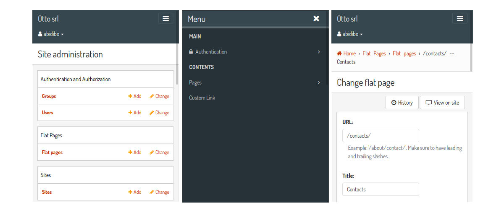
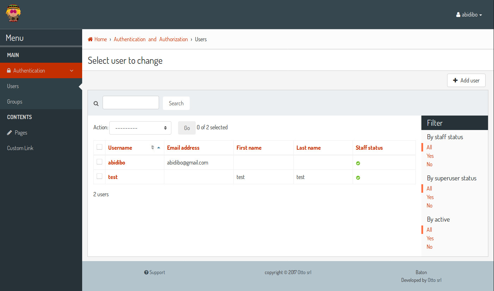

# django-baton

A cool, modern and responsive django admin application, based on bootstrap 4-alpha6

## Features

Tested with django 1.10.5

This application was written with one concept in mind: overwrite as few django templates as possible.
Everything is styled through css, and when an help is needed, js is armed. It doesn't require any other python package.

At the moment __baton__ defines only 3 custom templates:

- `admin/base_site.html`, needed in order to inject the js application (which includes also css and graphics, compiled with [webpack](https://webpack.github.io/));
- `admin/delete_confirmation.html`, needed because of a bug (IMO) in the template, in particular the `extra_head` block does not contain the parent content, hence it must be overridden;
- `admin/delete_selected_confirmation.html`, same as above.

Baton is based on the following frontend technologies:

- bootstrap 4-alpha6
- FontAwesome 4.7.0

Flexbox is used here and there to accomplish responsiveness. jQuery is used for DOM manipulations.

All js, fonts and css are compiled, and produce a single js file which is included in the base_site template.

A custom menu is provided, the menu is rendered through js, and data are fetched in json format through ajax request.

## Installation

Until version 0.1.0 will be released, you can pip install the repo master branch

    pip install git+https://github.com/otto-torino/django-baton

or clone the repo inside your project

    git clone https://github.com/otto-torino/django-baton.git

Add `baton` and `baton.autodiscover` to your `INSTALLED_APPS`:

    INSTALLED_APPS = (
        # ...
        'baton',
        'django.contrib.admin',
        # ...
        'baton.autodiscover',
    )

And add baton to your `urls.py`:

    urlpatterns = [
        # ...
        url(r'^baton/', include('baton.urls')),
    ]

### Why two installed apps?

Well, the first `baton` has to be placed before the `django.contrib.admin` app, because it overrides 3 templates and resets all css.
The `baton.autodiscover` entry is needed as the last installed app in order to register all applications for the admin.
I decided to create a custom `AdminSite` class, in order to allow the customization of some variables the django way (`site_header`, `index_title`, ...). I think this is a good approach,
better than customizing this vars overwriting the orignal templates. The problem is that when creating a custom AdminSite, you should register manually all the apps. I didn't like
this, so I wrote this `autodiscover` module, which automatically registers all the apps already registered with the django default AdminSite. In order to do this, all the apps must be already registered, so it comes as the last installed app.

## Configuration

The configuration dictionary must be defined inside your settings:

    BATON = {
        'SITE_HEADER': 'Baton',
        'SITE_TITLE': 'Baton',
        'INDEX_TITLE': 'Site administration',
        'SUPPORT_HREF': 'https://github.com/otto-torino/django-baton/issues',
        'COPYRIGHT': 'copyright © 2017 <a href="https://www.otto.to.it">Otto srl</a>', # noqa
        'POWERED_BY': '<a href="https://www.otto.to.it">Otto srl</a>',
        'MENU': (
            { 'type': 'title', 'label': 'main', 'apps': ('auth', ) },
            {
                'type': 'app',
                'name': 'auth',
                'label': 'Authentication',
                'icon': 'fa fa-lock',
                'models': (
                    {
                        'name': 'user',
                        'label': 'Users'
                    },
                    {
                        'name': 'group',
                        'label': 'Groups'
                    },
                )
            },
            { 'type': 'title', 'label': 'Contents', 'apps': ('flatpages', ) },
            { 'type': 'model', 'label': 'Pages', 'name': 'flatpage', 'app': 'flatpages' },
            { 'type': 'free', 'label': 'Custom Link', 'url': 'http://www.google.it', 'perms': ('flatpages.add_flatpage', 'auth.change_user') },
        )
    }

- `SITE_HEADER`, `COPYRIGHT` and `POWERED_BY` are marked as safe, so you can include also img tags, and link for example.
- `SUPPORT_HREF` is the content of an href attribute, then you can use also a `mailto:info@blabla.com`

Let's see the `MENU` configuration in detail.

### MENU

Currently four kind of voices are supported: _title_, _app_, _model_ and _free_.

First of all, if you don't define a MENU key in the configuration dictionary, the default MENU is shown.
If you define a MENU key, then the custom menu is built and shown.

#### Title

Like __MAIN__ and __CONTENTS__ in the screenshot, it represents a menu section. You should set a label and optionally an apps or perms key, used for visualization purposes.

If the title voice should act as a section title for a group of apps, you'd want to specify these apps, because if the user can't operate over them, then the voice is not shown.
At the same time you can define some perms (OR condition), something like:

    { 'type': 'title', 'label': 'main', 'perms': ('auth.add_user', ) },

#### App

You must specify the _type_ and _name_ keys, optionally an icon key (you can use FontAwesome classes which are included by default) and a _models_ key.
If you don't define the _models_ key then the default app models are listed under your app, otherwise only the specified models are listed (in the order you provide).

#### Model

You must specify the _type_, _name_ and _app_ keys, optionally an icon key (you can use FontAwesome classes which are included by default).

#### Free

You can specify free voices, youmust define an _url_ and if you want some visibility permissions (OR clause)

## Customization

It's easy to heavily customize the appeareance of __baton__. All the stuff is compiled from a modern js app which resides in `baton/static/baton/app`.

You just need to change the sass variables values (and you can overwrite also bootstrap variables), re-compile, get the compiled js file, place it in the static folder of your main app,
and place your main app (ROOTAPP) before __baton__ in the `INSTALLED_APPS`.

So:

    $ git clone https://github.com/otto-torino/django-baton.git
    $ cd django-baton/baton/static/baton/app/
    $ npm install
    $ vim src/styles/_variables.scss
    $ npm run compile
    $ cp dist/baton.min.js ROOTAPP/static/baton/app/dist/

If you want to test live your changes it's easy, just start the webpack dev server:

    $ cd django-baton/baton/static/baton/app/
    $ npm run dev

And the inside the `base_site.html` template uncomment make these changes:

    <!--  comment the compiled src and uncomment the webpack served src -->
    

Now while you make your changes to the js app (css included), webpack will update the bundle automatically, so just refresh the page and you'll see your changes.

## State of art

This application is currently in development. It is not suitable for production. I wrote every single css rule from scratch, testing it with my often used applications.
Probably some widgets are still not styled, some admin features too. But if you use it and report styling problems in the issues page I will proceed faster to a definitive 0.1.0 release.

Also this application is meant for use with modern browsers, targeting all recent versions of chrome, firefox an IE. Surely it will cause graphic disasters with older IE versions.

## TODO

- write tests
- integrate [django-otto-admin](https://github.com/otto-torino/django-otto-admin), or better, integrate a google analytics index page
- improve documentation (readthedocs)

